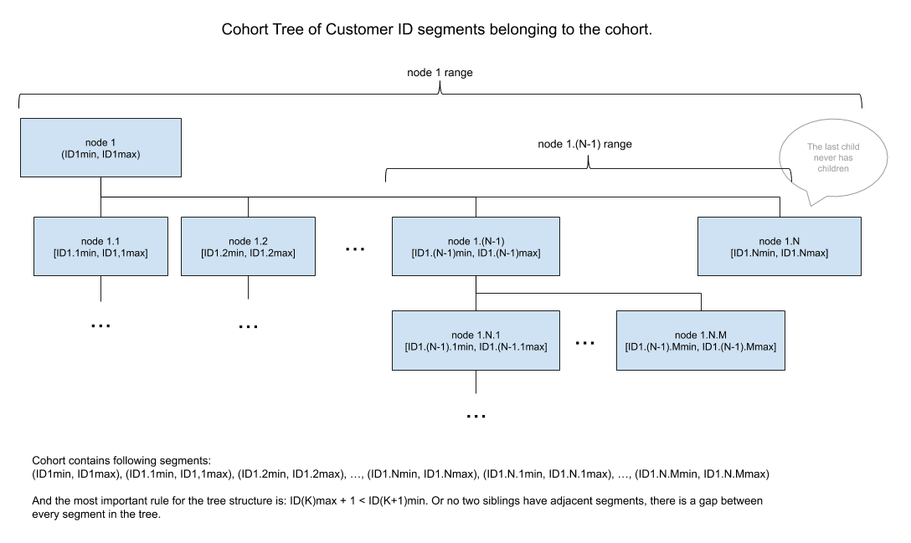

# Coding assignment - Cohort Analysis

__by Vinko Buble, Dec, 2019__

## Assignment

[](https://github.com/vinkobuble/cohort-analysis/tree/master/assignment)

## Cohort Analysis Script

Cohort Analysis is a Python 3.7 script that processes two input CSV files, one containing customers and the other containing orders data.
The output of the script is a CSV file with customers cohorts usage analytics per week:
 1. count of unique users in a cohort.
 2. count and percentage of unique users in a week.
 3. count and percentage of 1st time users in a week.
 
 The sample input CSV files can be found in the [data](./data) folder.
 

## How to run script

### Docker

The safest way the script will run is to start it inside a Docker container.

From the project root folder, where the `Dockerfile` is located, run:

```
docker build -t cohort-analysis . 
```

If you cloned the repo in `Downloads` folder and extracted it there then execute:
```
docker run --rm -v ~/Downloads/cohort-analysis/data:/data -ti cohort-analysis python . --customers-file /data/customers.csv --orders-file /data/orders.csv --timezone -0800 --output-file /data/output.csv
```
Or change the path `~/Downloads/cohort-analysis` to the absolute repo path (keep the `/data` part if you are reusing the `/data` folder). 
 
There are already sample files in [data](./data) folder inside the project folder.

The script will generate `output.csv` file inside the [data](./data) folder.


#### Run tests

Do not forget to change the `/data` folder path. It has to be absolute. 
```
docker run --rm -v ~/Downloads/cohort-analysis/data:/data -ti cohort-analysis python -m unittest
```


### Python

#### Requirements 

The only requirement for script is Python 3.7.x. No other dependecy has been added.

#### Execute

To get list of all cli arguments run (change `path/to/solution/directory` with the true path to the `solution` folder). That is `./solution` relative to this folder.

`python3 path/to/solution/directory --help` 

Run the script with input files within the [data](./data) folder.

`python3 path/to/solution/directory --customers-file ./data/customers.csv --orders-file ./data/orders.csv --timezone -0800 --output-file ./data/output.csv`

#### Running tests

Change the current folder to the `solution` folder (`cd solution`) and run:

```python3 -m unittest```


## Solution

The calculation of the report is performed in four stages: 
1. Generate cohort customer ID segments tree out of customers CSV file [cohort_customer_segment_tree.py](./solution/src/cohort_customer_segment_tree.py)
2. Prepare customer ID -> cohort ID lookup - resolve cohort ID by customer ID. [customer_cohort_index.py](./src/solution/customer_cohort_index.py)
3. Reading orders CSV file, and aggregating the statistics. [cohort_statistics.py](./src/solution/cohort_statistics.py)
4. Generating report - output to CSV file. [report_generator.py](./src/solution/report_generator.py)

### Cohort customer ID tree

The core idea behind implementation of the tree is preserving the memory footprint while improving the time complexity of the algorithm.

This cohort/customer mapping algorithm assumes that function
```
f(Customers ID) = Customer Creation Date/Time
```
is almost monotonic and continuous.

Graphical presentation of continuous monotonic and almost continuous monotonic cohort functions.


**Note**: Following notations are used in the rest of the document: 
- `N` as number of customers, 
- `M` as number of orders, 
- `K` as number of cohorts,
- `S` as maximum number of segments per cohort.

For better understanding of the relations between numbers:

`M >> N >> K ~ S`

`M`(orders) could be split by weeks, while we should be careful with splitting `N` (customers).

In the case of monotonic continuous function, each cohort would have only one segment, and the algorithm of building it would consist only of calculating `[min, max]` customer ID values for each cohort: time complexity `O(N)`, space complexity `O(K)`. Then an index for mapping Customer ID to Cohort ID is just a binary search through the list of customer ID segments.

Since we have an almost monotonic continuous function (very few customer IDs are out of the order), our structure will have more than one segment of customer IDs per cohort, but not as close as if the customer set is random. Therefore we use trees to represent cohort customer ID segments as the structure that would produce the minimal time and space complexity. In its nature it is an `S`-ary tree, which means every node has no more than `S` children.

Time Complexity of this step is `O(NlogS)`.
Space complexity is `O(K*S)`.

Otherwise, if list was used, the complexity of `insert` and `del` list operations would produce an algorithm with the `O(N^2/K)` complexity.

As the last step we flatten the structure to get a sorted list of customer ID segments for fast lookup by customer ID. 
Time complexity of this step is `O(K*S)`, since it is only traversing through the trees and collecting segments. You can imagine this step as 'balancing the trees'.

The visual presentation of the single cohort tree structure:




### Prepare customer ID -> cohort ID lookup

In this step we take dictionary with cohort segments trees, and construct the list of root nodes. 
Then this list is sorted by the lowest customer ID in the cohort. 

The end result is `K` lists (one per each cohort), and maximum `S` segments per cohort list. Both lists are sorted and binary search can be used for lookups. 

This way we achieve customer ID lookup time complexity of `O(logK x logS)`.


### Aggregating statistics from orders file

Next, the script reads the orders file, and finds minimum and maximum weeks for the cohort, and collects customers for each week in sets. 
This is the trickiest part, since no space complexity optimization better than `O(M)` could be found.

The reason for collection all users per week and keeping them in the memory is coming from the requirement to find first-time orderers. 
The only way to count first time orderers is to maintain the unique set of customers per week, and calculate set difference between the current week customers and all customers in the previous weeks.
And this step has to be done after all orders have been processed.

There is `--max_weeks` CLI argument to limit number of weeks to process in the cases where there is more data than available memory.

The time complexity of this step is `O(M x logS x logC)` - for each order we need to perform customer ID lookup to find which cohort the customer belongs.

### Generating report - output CSV file

The simplest of all steps. Take aggregated statistics and cohorts infos, and write the data out in CSV file. 
The time complexity is `O(C x W)` where C is the number of cohorts, and W is the number of weeks.
The space complexity is `O(1)`, if we take into consideration that all needed memory is allocated in the previous step and not counting the output file as a memory consumer.

## Additional improvements

Additional improvements to the script that could be done:
1. Progress reporting. Currently script reports only when it completes a particular step, but nothing in between. There would be an progress report object which would receive progress event, and this object would print the response out or store in the file.
2. Continuing from the point where script was interrupted. It is of utmost importance for a long running scripts to be able to continue when they are interrupted. That means that script should be able to persist intermediate states and read them when it loads.

